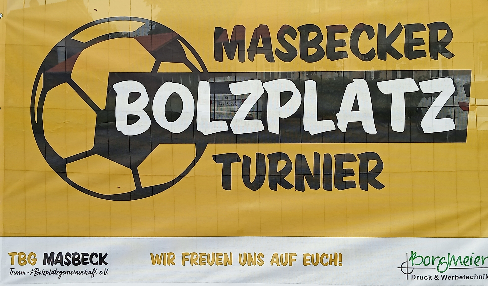

# FussballTurnier

Turnierverwaltung für Fußball-Turniere unter Windows (Embarcadero **Delphi / VCL**).
Zwei-Gruppen-Vorrunde, K.-o.-Runde mit Beamer-Turnierbaum, live aktualisierte
Tabellen und Ergebnisse sowie ein druckbarer **Aushang** (HTML/PDF) mit frei
einstellbarem Veranstalter (Name + Logo).

## Funktionen

- **Mannschaften** in zwei Gruppen (A/B, bis zu 6 Teams je Gruppe)
- **Gruppentabellen** automatisch (Punkte → Tordifferenz → Tore), per Knopf A ⇄ B umschaltbar
- **Ergebnisliste** aller Gruppenspiele
- **K.-o.-Runde**: 2 Halbfinale + Endspiel, Paarungen frei wählbar
- **Beamer-Übersicht**: klassischer Turnierbaum, aktualisiert sich selbst
- **„Aktuelles Spiel"** als große Beamer-Anzeige
- **Aushang** als HTML (öffnet im Browser → Strg+P → als PDF), inkl. Veranstalter-Kopf
- **Veranstalter** (Name + Icon) einstellbar – erscheint in Aushang, Tabelle und Ergebnissen
- **Speichern/Laden** des kompletten Turniers als `.trn`

## Build & Start

- Embarcadero **Delphi 10.3 „Rio" oder neuer** (nutzt Inline-Variablen und `Default(...)`).
- `FussballTurnier.dproj` in Delphi öffnen und mit **F9** starten (Zielplattform **Win32**).
- Die Bilddateien `MasbeckPoster.jpg` (Startseiten-Poster, Demo) und `logorw96.png` (Logo)
  liegen im Projektordner und werden zur Laufzeit relativ zur EXE geladen.

## Bedienung (kurz)

| Menü | Funktion |
|------|----------|
| **Turnier → Mannschaften** | Teams anlegen, Gruppe A/B wählen |
| **Turnier → Spielpaarungen** | Gruppenspiele + Ergebnisse eintragen |
| **Turnier → Tabelle / Ergebnisliste** | Auswertung (Beamer-tauglich) |
| **Turnier → KO-Runde / KO-Übersicht (Beamer)** | K.-o.-Phase + Turnierbaum |
| **SpielInfo → Aktuelles Spiel** | Anzeige des laufenden Spiels |
| **Datei → Veranstalter…** | Name + Icon festlegen |
| **Datei → Aushang erstellen…** | HTML-Aushang erzeugen und öffnen |
| **Datei → Neu / Öffnen / Speichern** | Turnier als `.trn` verwalten |

## Demo-Material

`MasbeckPoster.jpg` ist ein Beispiel-Poster (Masbecker Bolzplatz-Turnier) und dient
ausschließlich der Demonstration. Es kann Logos Dritter enthalten (siehe LICENSE).

## Lizenz

**Alle Rechte vorbehalten.** Nutzung, Veränderung oder Weitergabe nur nach vorheriger
Rücksprache und ausdrücklicher Zustimmung des Autors – siehe [LICENSE](LICENSE).

© 2026 RwTec (@RwHexa)
